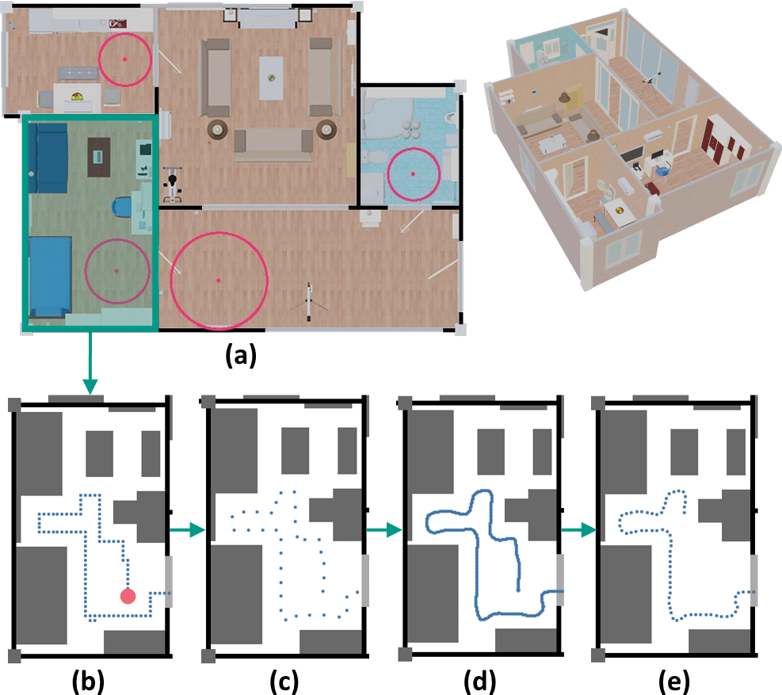

# House-Traveler: Trajectory generator for 3D house exploration

# Introduction

We propose a trajectory generator, the House-Traveler, which creates natural paths for the 3D house exploration. It is important to find optimal trajectories allowing an agent to observe every aspect of the scene efficiently while avoiding redundant visiting. To accomplish this, we developed a trajectory generator. 

This process begins by finding the appropriate starting points. A starting point should be placed in a space with sufficient movable area to prevent failure of path creation, taking into account the agent's size and avoidance range. To this end, we use the Pole of Inaccessibility (PIA), which is a point where the largest circle can be drawn in the polygon. We extract PIAs where the circle radius is greater than 40 cm inside each room of the house as the starting points. From a starting point, a trajectory is first drawn by the wall-following algorithm with the right-hand rule in the movable area of the house while avoiding obstacles (e.g., wall, furniture, household objects on the floor).

Since the observable scenes on the simple trajectory can be monotonous, some diversity is given by adding Gaussian random noise every three steps. The distorted trajectory is then split into two trajectories, one for each direction of the round trip using different poses, by alternatively sampling each step. House-Traveler draws a smooth trajectory using Linear Quadratic Regulator (LQR), an algorithm used in the automobile and robotics field for steering and speed control. Here, the agent moves 144 steps (20 cm per step), rotates 180 degrees at the destinations (in 12 steps), and returns to the starting point.

In this way, a trajectory consisting of 300 frames is created. After that, the trajectory generation begins again from the point to which it returned. While traveling, if the agent reaches a previously visited point, the trajectory generation is stopped and restarted at the next starting point to prevent redundancy.

<p align="center"></p>


### Trajectory generation procedure

- (a) Choosing the start point. Red dots mark the candidate starting points. 

- (b) Navigation by right-hand rule in the house. 

- (c) Applying Gaussian random noise every three steps. 

- (d) Connecting the dots using the Linear-Quadratic Regulator algorithm. 

- (e) Partitioning the trajectory into a step size of 144.


### Required environment

- Ubuntu 16.04 or above
- Python 3.6


### Installation

1. Install python packages

   ```Shell
   pip install -r requirement.txt
   ```


### Running the demo

1. Run the following python file for test 

   ```Shell
   python house_traveler.py
   ```


### Citation

If you find XX useful in your research, please consider citing:

    @inproceedings{placenet,
        Author = {Chung-Yeon Lee and Youngjae Yoo and Byeong-Tak Zhang},
        Title = {PlaceNet: Neural Spatial Representation Learning with Multimodal Attention},
        booktitle = {International Joint Conference on Artificial Intelligence (IJCAI)},
        Year = {2022}
    }

